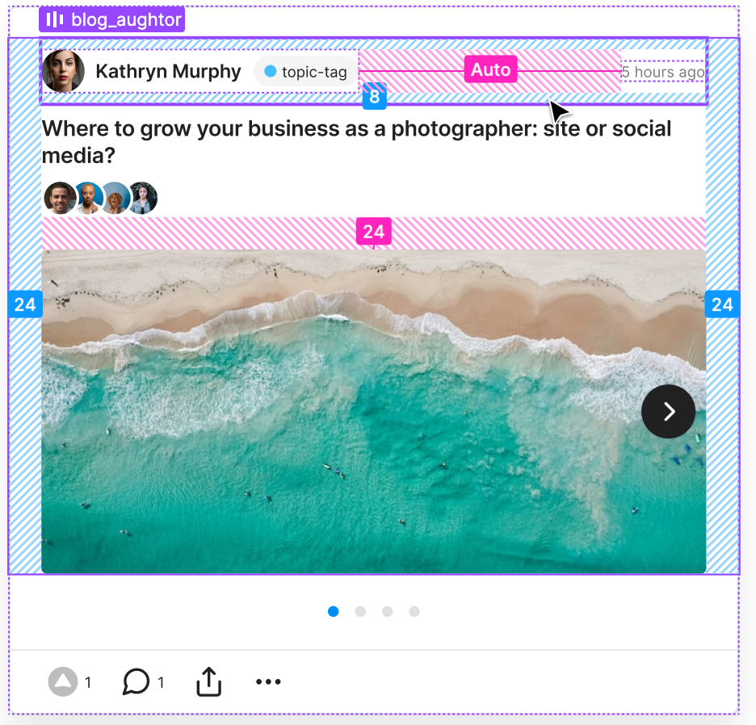

# Memo Communications React Technical Interview

To understand how you code, and how you interpret a technical design, we want to see how you code the follow element from Memo. 

## Goal

Assets are in the assets folder.

### Measurements

## Behaviors 

### Lift Icon  

The Lift Icons is a button which should increase a (local) **stateful** counter. Think of it like a "Like" button. For our purposes it will simply increase (without an upper limit) by 1 for each press. 

### More Menu  

The More menu is a menu which should open with the following options: 
1. Share on X
1. Share on LinkedIn
1. Copy Link
